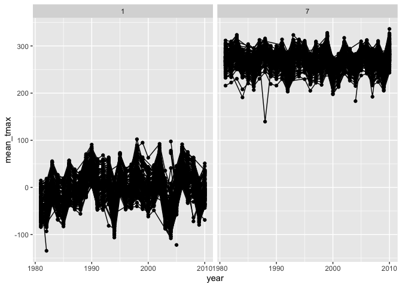
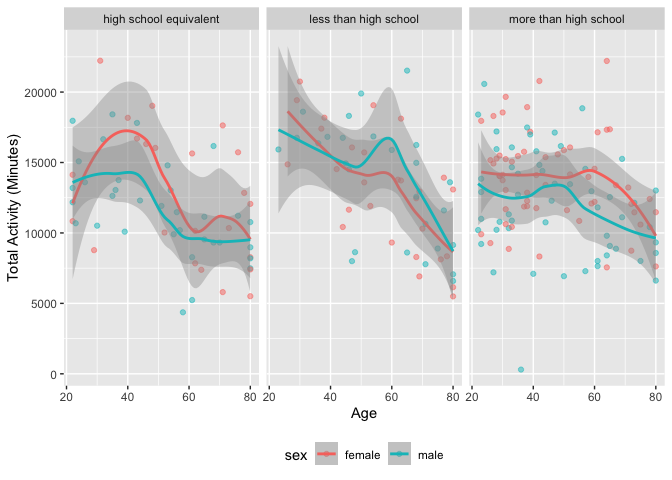
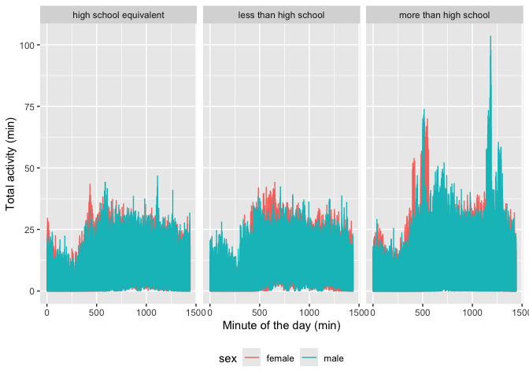
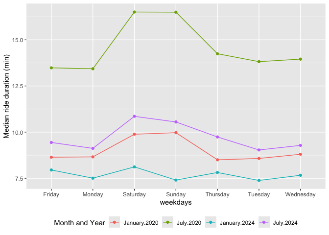
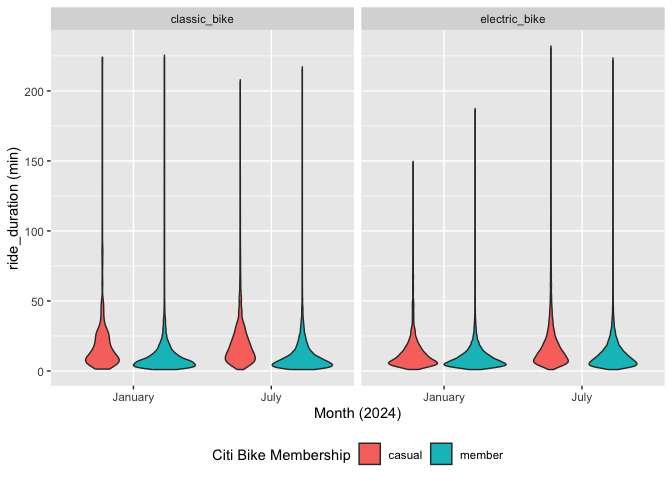

P8105 HW3 mm6410
================
Mahdi Maktabi
2024-10-11

``` r
library(tidyverse)
library(dplyr)
library(ggridges)
library(ggplot2)
library(patchwork)
```

## Problem 1

Load in `NY NOAA` data and initial exploration.

``` r
library(p8105.datasets)
data("ny_noaa")
```

``` r
summary(ny_noaa)
```

    ##       id                 date                 prcp               snow       
    ##  Length:2595176     Min.   :1981-01-01   Min.   :    0.00   Min.   :  -13   
    ##  Class :character   1st Qu.:1988-11-29   1st Qu.:    0.00   1st Qu.:    0   
    ##  Mode  :character   Median :1997-01-21   Median :    0.00   Median :    0   
    ##                     Mean   :1997-01-01   Mean   :   29.82   Mean   :    5   
    ##                     3rd Qu.:2005-09-01   3rd Qu.:   23.00   3rd Qu.:    0   
    ##                     Max.   :2010-12-31   Max.   :22860.00   Max.   :10160   
    ##                                          NA's   :145838     NA's   :381221  
    ##       snwd            tmax               tmin          
    ##  Min.   :   0.0   Length:2595176     Length:2595176    
    ##  1st Qu.:   0.0   Class :character   Class :character  
    ##  Median :   0.0   Mode  :character   Mode  :character  
    ##  Mean   :  37.3                                        
    ##  3rd Qu.:   0.0                                        
    ##  Max.   :9195.0                                        
    ##  NA's   :591786

``` r
str(ny_noaa)
```

    ## tibble [2,595,176 × 7] (S3: tbl_df/tbl/data.frame)
    ##  $ id  : chr [1:2595176] "US1NYAB0001" "US1NYAB0001" "US1NYAB0001" "US1NYAB0001" ...
    ##  $ date: Date[1:2595176], format: "2007-11-01" "2007-11-02" ...
    ##  $ prcp: int [1:2595176] NA NA NA NA NA NA NA NA NA NA ...
    ##  $ snow: int [1:2595176] NA NA NA NA NA NA NA NA NA NA ...
    ##  $ snwd: int [1:2595176] NA NA NA NA NA NA NA NA NA NA ...
    ##  $ tmax: chr [1:2595176] NA NA NA NA ...
    ##  $ tmin: chr [1:2595176] NA NA NA NA ...
    ##  - attr(*, "spec")=
    ##   .. cols(
    ##   ..   id = col_character(),
    ##   ..   date = col_date(format = ""),
    ##   ..   prcp = col_integer(),
    ##   ..   snow = col_integer(),
    ##   ..   snwd = col_integer(),
    ##   ..   tmax = col_character(),
    ##   ..   tmin = col_character()
    ##   .. )

``` r
ny_noaa |> 
  summarize(across(everything(), ~sum(is.na(.))))
```

    ## # A tibble: 1 × 7
    ##      id  date   prcp   snow   snwd    tmax    tmin
    ##   <int> <int>  <int>  <int>  <int>   <int>   <int>
    ## 1     0     0 145838 381221 591786 1134358 1134420

``` r
ny_noaa |> 
  count(snow) |> 
  arrange(desc(n))
```

    ## # A tibble: 282 × 2
    ##     snow       n
    ##    <int>   <int>
    ##  1     0 2008508
    ##  2    NA  381221
    ##  3    25   31022
    ##  4    13   23095
    ##  5    51   18274
    ##  6    76   10173
    ##  7     8    9962
    ##  8     5    9748
    ##  9    38    9197
    ## 10     3    8790
    ## # ℹ 272 more rows

Looking at the `NY NOAA` data, we can see that there are 2,595,176
observations and 7 variables. The variables include: id, date, prcp,
snow, snwd, tmax, and tmin.

We can also see from the `summarize` function that there is a lot of
missing data in each column. Similarly, the most common observed value
for snowfall is zero. This makes sense because the data shows snowfall
accumulation throughout the year but it rarely snows in NY.

The code below will begin cleaning the data by separating the dates into
year, month, and day columns.

``` r
ny_noaa = ny_noaa |> 
  separate(
    date, into = c("year", "month", "day"), 
    convert = TRUE) |> 
  mutate(
    tmax = as.numeric(tmax),
    tmin = as.numeric(tmin)
  )
```

Making a two-panel plot:

``` r
ny_noaa |> 
  group_by(id, year, month) |> 
  filter(month %in% c(1, 7)) |> 
  summarize(mean_tmax = mean(tmax, na.rm = TRUE, color = id)) |>  
  ggplot(aes(x = year, y = mean_tmax, group = id)) + 
  geom_point() + 
  geom_path() +
  facet_grid(~month)
```

    ## `summarise()` has grouped output by 'id', 'year'. You can override using the
    ## `.groups` argument.

    ## Warning: Removed 5970 rows containing missing values or values outside the scale range
    ## (`geom_point()`).

    ## Warning: Removed 5931 rows containing missing values or values outside the scale range
    ## (`geom_path()`).

<!-- -->

Based on the graph, we can see that the average max temperature in
January is a lot lower than July. In both figures, there are some
outliers that fall below the other data points. For example, in January,
we see that temperatures drop very low around 1980 and 2005.

The code below will create a hex plot showing `tmin` vs `tmax` and the
distribution of snowfall values greater than 0 and less than 100
(separated by year).

***Note***: I did not know how to do this so I used the homework answers
that were posted.

``` r
hex = 
  ny_noaa %>% 
  ggplot(aes(x = tmin, y = tmax)) + 
  geom_hex()

ridge = 
  ny_noaa %>% 
  filter(snow < 100, snow > 0) %>%
  ggplot(aes(x = snow, y = as.factor(year))) + 
  geom_density_ridges()

hex + ridge
```

    ## Warning: Removed 1136276 rows containing non-finite outside the scale range
    ## (`stat_binhex()`).

    ## Picking joint bandwidth of 3.76

<!-- -->

## Problem 2

Importing and cleaning *NHAMES Study* participant demographic and
accelerometer data.

``` r
demographics_df = 
  read_csv(
    file = "./data/nhanes_covar.csv",
    na = c("NA", ".", ""),
    skip = 4) |> 
  janitor::clean_names() |> 
  mutate(
    sex =
      case_match(
        sex,
        1 ~ "male",
        2 ~ "female"),
    sex = as.factor(sex))

accel_df =
  read_csv(
    file = "./data/nhanes_accel.csv") |> 
  janitor::clean_names() |> 
  pivot_longer(
    min1:min1440,
    names_to = "min",
    names_prefix = "min",
    values_to = "min_value") |> 
  mutate(min = as.numeric(min))
```

Now I am merging the two datasets and excluded:

- Participants less than 21 years old
- Participants missing demographic data

``` r
accel_tidy_df = 
  left_join(accel_df, demographics_df, by = "seqn") |>
  janitor::clean_names() |>
  filter(age > 21, !is.na(sex), !is.na(age), !is.na(bmi), !is.na(education)) |> 
  select(seqn, sex, age, bmi, education, min, min_value)
```

The code below will create a table that will show the number of men and
women in each education category.

``` r
accel_tidy_df |> 
  group_by(sex, education) |> 
  summarize(count = n_distinct(seqn), .groups = 'drop') |> 
  mutate(
    education = case_when(
      education == 1 ~ "less than high school",
      education == 2 ~ "high school equivalent",
      education == 3 ~ "more than high school")) |> 
  pivot_wider(
    names_from = education,
    values_from = count,
    values_fill = 0) |> 
  knitr::kable()
```

| sex    | less than high school | high school equivalent | more than high school |
|:-------|----------------------:|-----------------------:|----------------------:|
| female |                    28 |                     23 |                    59 |
| male   |                    27 |                     34 |                    54 |

From the table, we can see that the distribution between each education
category is fairly equal between male and females. There are slightly
more males that have a high school equivalent education compared to
females.

The code below will now show the age distribtuions for men and women in
each education category.

``` r
accel_tidy_df |> 
  distinct(seqn, age, sex, education) |> 
  mutate(
    education = case_when(
      education == 1 ~ "less than high school",
      education == 2 ~ "high school equivalent",
      education == 3 ~ "more than high school")) |> 
  ggplot(aes(x = age, fill = sex)) +
  geom_density(alpha = 0.5) +
  facet_wrap(~ education) +
  theme(legend.position = "bottom") +
  labs(
    x = "Age",
    y = "Density of participants")
```

<!-- -->

Based on the graphs, we can see that:

- *Less than high school*: The distribution based on age are similar
  between sexes.
- *High school equivalent*: There are more older females than males and
  the distribution of females is slightly left-skewed.
- *More than high school*: The distribution between sexes is similar but
  there much more younger females than males.

Now I will create a total activity variable:

``` r
accel_tidy_df |> 
  group_by(seqn, sex, age, education) |> 
  summarize(total_activity = sum(min_value, na.rm = TRUE), .groups = 'drop') |> 
  mutate(
    education = case_when(
      education == 1 ~ "less than high school",
      education == 2 ~ "high school equivalent",
      education == 3 ~ "more than high school"
    )) |> 
  ggplot(aes(x = age, y = total_activity, color = sex)) +
  geom_point(alpha = 0.5) +
  geom_smooth(method = "loess") +
  facet_wrap(~ education) +
  theme(legend.position = "bottom") +
  labs(
    x = "Age",
    y = "Total Activity (Minutes)")
```

<!-- -->

Based off this graph, we can see that:

- *Less than high school*: there is more total activity for both sexes
  around 21 years old but rapidly trends downwards as age increases.
  There is a spike of total activity for males at around age 60.
- *High school equivalent*: for both sexes total activity trends upwards
  and peaks around age 40 but then decreases. Total activity peaks for
  females are higher.
- *More than high school*: total activity plateaus around 13000 minutes
  until about age 60 and then decreases for both sexes.

Now I will show the 24-hour activity time courses for each education
level.

``` r
accel_tidy_df |> 
  group_by(seqn, sex, education, min) |> 
  summarize(total_activity = sum(min_value, na.rm = TRUE), .groups = 'drop') |> 
  mutate(
    education = case_when(
      education == 1 ~ "less than high school",
      education == 2 ~ "high school equivalent",
      education == 3 ~ "more than high school")) |> 
  ggplot(aes(x = min, y = total_activity, color = sex)) +
  geom_line() +
  facet_wrap(~ education) +
  theme(legend.position = "bottom") +
  labs(
    x = "Minute of the day (min)",
    y = "Total activity (min)",
    color = "sex")
```

<!-- -->

Based on the graph, we can see that:

- *Less than high school*: total activity throughout the day remains
  consistent between sexes. Males have low levels of total activity
  present at earlier times of the day compared to females.
- *High school equivalent*: total activity throughout the day is
  consistent between sexes.
- *More than high school*: For males, activity increases at around 8am
  (500 minutes) and peaks extremely high around 8pm (1200 minutes). For
  females, we see that activity also increases around 8am (500 minutes)
  but decreases for the rest of the day.

## Problem 3

Importing and cleaning the *NYC Citi Bike* data from Jan 2020, Jul 2020,
Jan 2024, and Jul 2024.

``` r
citi_jan_2020_df =
  read_csv(file = "./citibike/Jan 2020 Citi.csv", na = c("NA", ".", "")) |> 
  janitor::clean_names() |> 
  mutate(
    month = "January",
    year = "2020",
    year = as.numeric(year)) |> 
  select(ride_id, month, year, everything())

citi_jul_2020_df =
  read_csv(file = "./citibike/July 2020 Citi.csv", na = c("NA", ".", "")) |> 
  janitor::clean_names() |> 
  mutate(
    month = "July",
    year = "2020",
    year = as.numeric(year)) |> 
  select(ride_id, month, year, everything())

citi_jan_2024_df =
  read_csv(file = "./citibike/Jan 2024 Citi.csv", na = c("NA", ".", "")) |> 
  janitor::clean_names() |> 
  mutate(
    month = "January",
    year = "2024", 
    year = as.numeric(year)) |> 
  select(ride_id, month, year, everything())

citi_jul_2024_df =
  read_csv(file = "./citibike/July 2024 Citi.csv", na = c("NA", ".", "")) |> 
  janitor::clean_names() |> 
  mutate(
    month = "July",
    year = "2024",
    year = as.numeric(year)) |> 
  select(ride_id, month, year, everything())
```

Now combine into one dataset.

``` r
citibike_df =
  bind_rows(citi_jan_2020_df, citi_jul_2020_df, citi_jan_2024_df, citi_jul_2024_df) |>
  janitor::clean_names()
```

The combined dataset shows that there are 99,485 rows and 9 variables.
The additional variables added during the merging process was `month`
and `year` so I can identify which original dataset the data came from.

``` r
citibike_df |> 
  group_by(year, month, member_casual) |> 
  summarize(total_rides = n(), .groups = 'drop') |> 
  pivot_wider(
    names_from = member_casual,
    values_from = total_rides) |> 
  knitr::kable()
```

| year | month   | casual | member |
|-----:|:--------|-------:|-------:|
| 2020 | January |    984 |  11436 |
| 2020 | July    |   5637 |  15411 |
| 2024 | January |   2108 |  16753 |
| 2024 | July    |  10894 |  36262 |

The table shows that both casual and member riders increase overtime.
Casual riders increase at a higher rate but there are a lot more Citi
Bike member riders.

The code and table below will show: **The Top 5 Starting Stations for
July 2024**

``` r
citibike_df |> 
  group_by(start_station_name) |> 
  filter(month == "July", year == 2024) |> 
  summarize(total_rides = n(), .groups = 'drop') |> 
  arrange(desc(total_rides)) |> 
  slice_max(total_rides, n = 5) |> 
  knitr::kable()
```

| start_station_name       | total_rides |
|:-------------------------|------------:|
| Pier 61 at Chelsea Piers |         163 |
| University Pl & E 14 St  |         155 |
| W 21 St & 6 Ave          |         152 |
| West St & Chambers St    |         150 |
| W 31 St & 7 Ave          |         146 |

I will now make a plot that investigates the effect of the day of the
week, month, and year on median ride duration.

``` r
citibike_df |> 
  group_by(weekdays, month, year) |> 
  summarize(med_duration = median(duration, na.rm = TRUE), .groups = 'drop') |> 
  ggplot(
    aes(x = weekdays, y = med_duration, color = interaction(month, year), 
        group = interaction(month, year))) + 
  geom_line() + geom_point() +
  theme(legend.position = "bottom") +
  labs(
    x = "weekdays",
    y = "Median ride duration (min)",
    color = "Month and Year")
```

<!-- -->

From the graph we can see that:

- July 2020 had the highest median ride duration.
- Median ride duration (minutes) was highest on Saturday and Sunday
  across all Months and Years.
- January for both 2020 and 2024 had lower median ride duration compared
  to July. This makes sense because it is colder in January so we expect
  people to not have high ride duration.

``` r
citibike_df |> 
  filter(year == 2024) |> 
  ggplot(aes(x = month, y = duration, fill = member_casual)) +
  geom_violin() +
  facet_wrap(~ rideable_type) +
  theme(legend.position = "bottom") +
  labs(
    x = "Month (2024)",
    y = "ride_duration (min)",
    fill = "Citi Bike Membership")
```

<!-- -->

Based on the boxplot:

- Classic Bikes
  - The distribution is similar between January and July for both casual
    and member riders.
  - Casual riders are riding for a longer duration than member riders.
- Electric Bikes
  - The distribution is similar between January and July for both casual
    and member riders. Casual riders are riding for a slightly longer
    duration in July.
  - Casual riders are riding for a slightly shorter duration compared to
    classic bikes.
  - Member riders are riding for the same duration between January and
    July as well as between classic and electric bikes.
