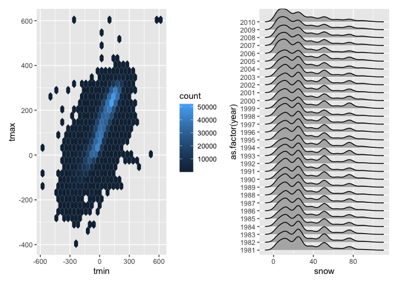

P8105 HW3 mm6410
================
Mahdi Maktabi
2024-10-11

``` r
library(tidyverse)
library(dplyr)
library(ggridges)
library(ggplot2)
```

## Problem 1

## Problem 2

Importing and cleaning *NHAMES Study* participant demographic and
accelerometer data.

``` r
demographics_df = 
  read_csv(
    file = "./data/nhanes_covar.csv",
    na = c("NA", ".", ""),
    skip = 4) |> 
  janitor::clean_names() |> 
  mutate(
    sex =
      case_match(
        sex,
        1 ~ "male",
        2 ~ "female"),
    sex = as.factor(sex))
```

    ## Rows: 250 Columns: 5
    ## ── Column specification ────────────────────────────────────────────────────────
    ## Delimiter: ","
    ## dbl (5): SEQN, sex, age, BMI, education
    ## 
    ## ℹ Use `spec()` to retrieve the full column specification for this data.
    ## ℹ Specify the column types or set `show_col_types = FALSE` to quiet this message.

``` r
accel_df =
  read_csv(
    file = "./data/nhanes_accel.csv") |> 
  janitor::clean_names() |> 
  pivot_longer(
    min1:min1440,
    names_to = "min",
    names_prefix = "min",
    values_to = "min_value") |> 
  mutate(min = as.numeric(min))
```

    ## Rows: 250 Columns: 1441
    ## ── Column specification ────────────────────────────────────────────────────────
    ## Delimiter: ","
    ## dbl (1441): SEQN, min1, min2, min3, min4, min5, min6, min7, min8, min9, min1...
    ## 
    ## ℹ Use `spec()` to retrieve the full column specification for this data.
    ## ℹ Specify the column types or set `show_col_types = FALSE` to quiet this message.

Now I am merging the two datasets and excluded:

- Participants less than 21 years old
- Participants missing demographic data

``` r
accel_tidy_df = 
  left_join(accel_df, demographics_df, by = "seqn") |>
  janitor::clean_names() |>
  filter(age > 21, !is.na(sex), !is.na(age), !is.na(bmi), !is.na(education)) |> 
  select(seqn, sex, age, bmi, education, min, min_value)
```

The code below will create a table that will show the number of men and
women in each education category.

``` r
accel_tidy_df |> 
  group_by(sex, education) |> 
  summarize(count = n_distinct(seqn), .groups = 'drop') |> 
  mutate(
    education = case_when(
      education == 1 ~ "less than high school",
      education == 2 ~ "high school equivalent",
      education == 3 ~ "more than high school")) |> 
  pivot_wider(
    names_from = education,
    values_from = count,
    values_fill = 0) |> 
  knitr::kable()
```

| sex    | less than high school | high school equivalent | more than high school |
|:-------|----------------------:|-----------------------:|----------------------:|
| female |                    28 |                     23 |                    59 |
| male   |                    27 |                     34 |                    54 |

From the table, we can see that the distribution between each education
category is fairly equal between male and females. There are slightly
more males that have a high school equivalent education compared to
females.

The code below will now show the age distribtuions for men and women in
each age category.

``` r
accel_tidy_df |> 
  distinct(seqn, age, sex, education) |> 
  mutate(
    education = case_when(
      education == 1 ~ "less than high school",
      education == 2 ~ "high school equivalent",
      education == 3 ~ "more than high school")) |> 
  ggplot(aes(x = age, fill = sex)) +
  geom_density(alpha = 0.5) +
  facet_wrap(~ education) +
  theme(legend.position = "bottom") +
  labs(
    x = "Age",
    y = "Density of participants")
```

<!-- -->

Based on the graphs, we can see that:

- *Less than high school*: The distribtuion based on age are similar
  between sexes.
- *High school equivalent*: There are more older females than males and
  the distribution of females is slightly left-skewed.
- *More than high school*: The distribution between sexes is similar but
  there much more younger females than males.

Now I will create a total activity variable:

``` r
accel_tidy_df |> 
  group_by(seqn, sex, age, education) |> 
  summarize(total_activity = sum(min_value, na.rm = TRUE), .groups = 'drop') |> 
  mutate(
    education = case_when(
      education == 1 ~ "less than high school",
      education == 2 ~ "high school equivalent",
      education == 3 ~ "more than high school"
    )) |> 
  ggplot(aes(x = age, y = total_activity, color = sex)) +
  geom_point(alpha = 0.5) +
  geom_smooth(method = "loess") +
  facet_wrap(~ education) +
  theme(legend.position = "bottom") +
  labs(
    x = "Age",
    y = "Total Activity (Minutes)")
```

    ## `geom_smooth()` using formula = 'y ~ x'

<!-- -->

Based off this graph, we can see that:

- *Less than high school*: there is more total activity for both sexes
  around 21 years old but rapidly trends downwards as age increases.
  There is a spike of total activity for males at around age 60.
- *High school equivalent*: for both sexes total activity trends upwards
  and peaks around age 40 but then decreases. Total activity peaks for
  females are higher.
- *More than high school*: total activity plateaus around 13000 minutes
  until about age 60 and then decreases for both sexes.

Now I will show the 24-hour activity time courses for each education
level.

``` r
accel_tidy_df |> 
  group_by(seqn, sex, education, min) |> 
  summarize(total_activity = sum(min_value, na.rm = TRUE), .groups = 'drop') |> 
  mutate(
    education = case_when(
      education == 1 ~ "less than high school",
      education == 2 ~ "high school equivalent",
      education == 3 ~ "more than high school")) |> 
  ggplot(aes(x = min, y = total_activity, color = sex)) +
  geom_line() +
  facet_wrap(~ education) +
  theme(legend.position = "bottom") +
  labs(
    x = "Minute of the day (min)",
    y = "Total activity (min)",
    color = "sex")
```

<!-- -->

Based on the graph, we can see that:

- *Less than high school*: total activity throughout the day remains
  consistent between sexes. Males have low levels of activity present at
  earlier times of the day compared to females.
- *High school equivalent*: total activity throughout the day is
  consistent between sexes.
- *More than high school*: For males, activity increases at around 8am
  (500 minutes) and peaks extremely high around 8pm (1200 minutes). For
  females, we see that activity also increases around 8am (500 minutes)
  but decreases for the rest of the day.

## Problem 3
